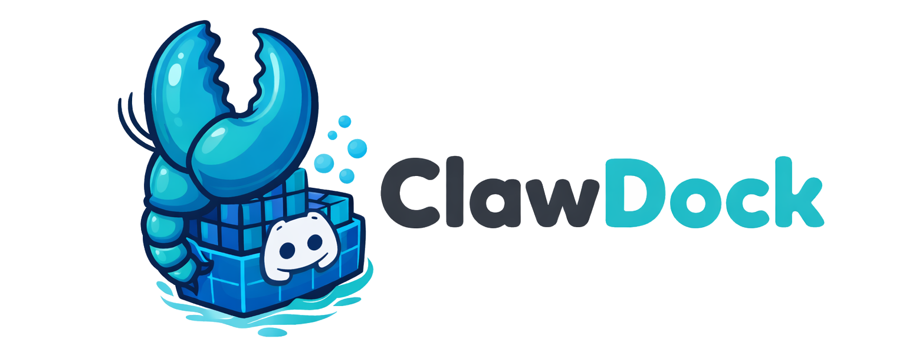

# ClawDock
<p align="center">
  
</p>

**ClawDock** is a personal Claude AI assistant running in Docker containers with Discord as the messaging layer. Fork of [NanoClaw](https://github.com/qwibitai/nanoclaw) — rebuilt for Linux homelab deployment.

<p align="center">
  
</p>

<p align="center">
  An OpenClaw-inspired Claude assistant that runs securely in containers. Lightweight and built to be understood and customized for your own needs.
</p>


## What Is This

ClawDock takes the core idea from NanoClaw — a lightweight, container-isolated AI assistant built on the [Claude Agent SDK](https://docs.anthropic.com/en/docs/agents-and-tools/claude-agent-sdk) — and makes two major changes:

1. **Discord replaces WhatsApp.** Each Discord channel maps to an isolated agent with its own memory, filesystem, and Docker container. No cross-channel data leakage.
2. **Docker on Linux replaces Apple Container on macOS.** Runs as a systemd service on a Linux VM, not a launchd daemon on a Mac.

The name "ClawDock" captures both the lineage (Claw, from NanoClaw/OpenClaw) and the Docker-first container strategy.

## How It Works

```
Discord (discord.js) → SQLite → Polling Loop → Docker Container (Claude Agent SDK) → IPC → Discord Response
```

Single Node.js process. Each registered Discord channel gets its own Docker container with mounted directories, a `CLAUDE.md` memory file, and an isolated Agent SDK session. The host process polls for new messages, spawns containers, and routes responses back through Discord.

Talk to the bot with the trigger word (configurable via `ASSISTANT_NAME` env var, default: `@Andy`):

```
@AssistantName summarize the git history for the past week and flag anything that looks like drift
@AssistantName every Monday at 8am, compile AI news from Hacker News and message me a briefing
@AssistantName what's on the family calendar this week
```

From the admin channel (`#main`), which responds to all messages without requiring the trigger word, manage the system:

```
list all scheduled tasks across channels
register #new-channel
pause the Monday briefing task
```

## Channel Isolation

Each Discord channel is a fully isolated context:

- **Own Docker container** — agents are sandboxed with explicit volume mounts, not prompt-level restrictions
- **Own memory** — `groups/{channel}/CLAUDE.md` persists context across conversations
- **Own filesystem** — mount allowlist (`~/.config/nanoclaw/mount-allowlist.json`) controls what each channel can access
- **Own session** — Agent SDK state in `data/sessions/{channel}/` prevents cross-channel session bleed

The `#main` channel is privileged (can register channels, view all tasks, access the full project filesystem). Every other channel operates in a sandbox.

See [docs/Groups-Use-Cases.md](docs/Groups-Use-Cases.md) for example channel configurations.

## Claude Model Override

ClawDock still uses Claude Code as the agent harness — the same "best harness, best model" philosophy from NanoClaw. However, ClawDock overrides the default Anthropic API endpoint, routing requests through [Z.AI](https://z.ai) (`ANTHROPIC_BASE_URL=https://api.z.ai/api/anthropic`). This enables per-channel model selection — each channel can run a different model tier based on its workload:

| Channel  | Model  | Use Case |
| -------- | ------ | -------- |
| #main    | sonnet | Admin — responds to all messages (no trigger required) |
| #family  | haiku  | Lightweight family logistics |
| #devwork | opus   | Engineering work with `~/dev/` mounted read-write |
| #gamedev | sonnet | Game development with `~/gamedev/` mounted read-write |

Safety limits are enforced per query: **$0.75 budget cap** and **30 turn limit**.

See [docs/CLAUDE-MODEL-OVERRIDE.md](docs/CLAUDE-MODEL-OVERRIDE.md) for full configuration details.

## Deployment

ClawDock is designed for always-on Linux deployment, not laptop-bound development sessions.

**Production** runs on a Linux VM (Ubuntu on Hyper-V) accessible via [Tailscale](https://tailscale.com), managed by a systemd user service:

```bash
systemctl --user start clawdock
systemctl --user status clawdock
journalctl --user -u clawdock -f
```

**Development** happens on a separate workstation. Push to GitHub, pull on the VM, rebuild, restart:

```
Dev machine → git push → GitHub → git pull on VM → npm run build → systemctl --user restart clawdock
```

The service file lives at `~/.config/systemd/user/clawdock.service` and uses `EnvironmentFile` to load `.env` before starting the Node.js process.

## Quick Start

```bash
git clone https://github.com/prillcode/clawdock.git
cd clawdock
claude
```

Then run `/setup` followed by `/convert-to-docker` and `/add-discord`. Claude Code handles dependencies, authentication, container image builds, and service configuration.

### Requirements

- Linux (Ubuntu recommended) or macOS
- Node.js 20+
- [Claude Code](https://claude.ai/download)
- [Docker](https://docker.com/products/docker-desktop)
- A Discord bot token ([Discord Developer Portal](https://discord.com/developers/applications))

### Environment Variables

Copy `.env.example` to `.env` and configure:

```bash
# Discord — set this to activate the Discord channel
DISCORD_BOT_TOKEN=your-bot-token

# Bot trigger word (also used as display name in agent memory)
# Default: "Andy"
ASSISTANT_NAME=YourBotName

# API provider — route through Z.AI or direct to Anthropic
ANTHROPIC_BASE_URL=https://api.z.ai/api/anthropic

# Safety limits
BUDGET_LIMIT=0.75
MAX_TURNS=30

# Optional: WhatsApp auth session also supported (runtime toggle)
# If both are configured, both channels run in parallel
```

## Architecture

Key files:

- `src/index.ts` — Orchestrator: state, message loop, agent invocation
- `src/channels/discord.ts` — Discord connection, auth, send/receive
- `src/ipc.ts` — IPC watcher and task processing
- `src/router.ts` — Message formatting and outbound routing (platform-aware)
- `src/group-queue.ts` — Per-group queue with global concurrency limit
- `src/container-runner.ts` — Spawns Docker containers with volume mounts
- `src/task-scheduler.ts` — Runs scheduled tasks (cron, interval, one-shot)
- `src/db.ts` — SQLite operations (`store/messages.db`)
- `groups/*/CLAUDE.md` — Per-channel memory
- `groups/global/CLAUDE.md` — Shared instructions applied to all channels

## What It Supports

- **Discord I/O** — message Claude from any registered Discord channel
- **Isolated channel context** — each channel has its own `CLAUDE.md` memory, isolated filesystem, and Docker container
- **Admin channel** — `#main` for system administration; all other channels are sandboxed
- **Scheduled tasks** — cron, interval, and one-shot jobs that run Claude and can message you back
- **Web access** — search and fetch content
- **Container isolation** — agents sandboxed in Docker with explicit filesystem mounts
- **Agent Swarms** — spin up teams of specialized agents that collaborate on complex tasks
- **Model override** — per-channel model selection (opus/sonnet/haiku) with configurable API provider routing
- **Safety limits** — per-query budget cap and turn limit to prevent runaway agent costs
- **Runtime channel toggle** — Discord and WhatsApp can coexist; environment variables control which channels activate
- **Optional integrations** — add Gmail (`/add-gmail`) and more via skills

## Customizing

Tell Claude Code what you want:

- "Change the trigger word to @Assistant"
- "Make responses shorter and more direct"
- "Add a custom greeting when I say good morning"
- "Store conversation summaries weekly"

Or run `/customize` for guided changes. The codebase is small enough that Claude can safely modify it.

## Project Status

ClawDock is deployed and running in production with four active Discord channels. See [docs/PROJECT-STATUS.md](docs/PROJECT-STATUS.md) for the full status, infrastructure details, and roadmap.

### ClawDock Web UI (Planned)

A separate project ([clawdock-web](https://github.com/prillcode/clawdock-web)) will add a browser-based chat interface for ClawDock — talk to any channel from a browser instead of Discord. The stack is React 19 + Vite + Tailwind on Cloudflare Pages, with a Hono API on Cloudflare Workers and D1 for storage. Phase 1 proxies messages through Discord; Phase 2 connects directly to NanoClaw via WebSocket/SSE for real-time streaming.

## Contributing

Following NanoClaw's philosophy: **don't add features, add skills.**

Want to add Telegram support? Don't create a PR that adds Telegram alongside Discord. Instead, contribute a skill file (`.claude/skills/add-telegram/SKILL.md`) that teaches Claude Code how to transform an installation. Users then run `/add-telegram` on their fork and get clean code that does exactly what they need.

## Upstream Relationship

ClawDock tracks [qwibitai/nanoclaw](https://github.com/qwibitai/nanoclaw) as an upstream remote for pulling bug fixes and security patches:

```bash
git remote add upstream https://github.com/qwibitai/nanoclaw.git
git fetch upstream
git merge upstream/main
```

Internal code references (config paths, TypeScript source) use the `nanoclaw` naming convention to minimize merge conflicts with upstream. Only user-facing documentation uses "ClawDock" branding.

## License

MIT

---

### Credits

ClawDock is a fork of [NanoClaw](https://github.com/qwibitai/nanoclaw) by [Gavriel Cohen](https://github.com/gavrielc) and contributors. NanoClaw was inspired by [OpenClaw](https://github.com/openclaw/openclaw) (formerly Clawdbot), built by [Peter Steinberger](https://github.com/steipete) and the community.

